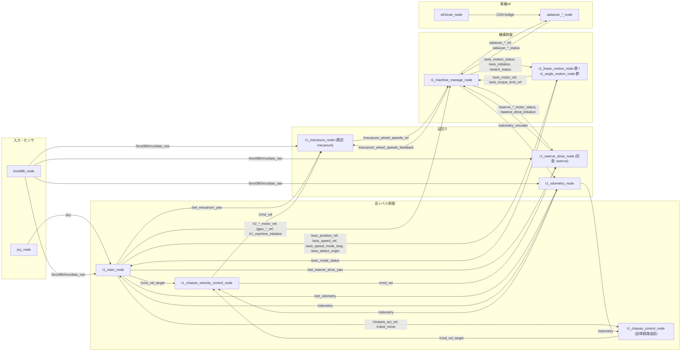
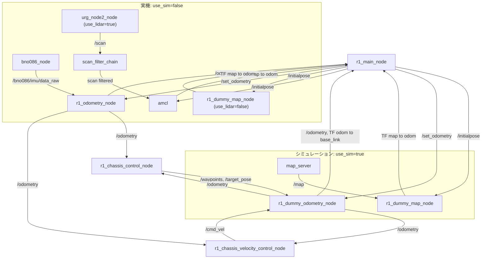

# gakurobo2026_r1

`gakurobo2026_r1` は、学生ロボコン 2026 R1の ROS 2 ワークスペース用リポジトリです。  
このリポジトリには、ロボット全体の状態管理、足回り制御、機構制御、起動設定、独自メッセージ定義が入っています。

このプロジェクトでは、主に `C++20` と `Python 3.10` を使用します。
Python は基本的に `venv` 環境を使用します。
開発環境は `Ubuntu 22.04`、ROS 2 のバージョンは `Humble` です。

Python 依存は [`requirements.txt`](./requirements.txt) にまとめています。  
既存 GUI、可視化スクリプト、`r1_ui` の ArUco 表示ノードを使う場合は、先に venv へインストールしてください。

## Python 環境

このリポジトリでは、ROS 2 の環境と自前の `.venv` を併用できます。  
ただし、Python ノードを `ros2 run` や `ros2 launch` で起動する場合は、依存を入れた Python で build しておく必要があります。

理由:

- `source install/setup.bash` は ROS パッケージ探索用の環境変数を設定します。
- `.venv` の有効化は、`python` と `pip` の向き先を切り替えます。
- `ament_python` パッケージの実行スクリプトは、build 時の Python interpreter を shebang に埋め込みます。
- そのため、system Python で build したノードは、後から `.venv` を有効化しても system Python で起動されることがあります。

特に GUI ノードや Python 依存を持つノードでは、次の順序を推奨します。

```bash
source /opt/ros/humble/setup.bash
source ~/ros2_ws/.venv/bin/activate
python -m pip install -r ~/ros2_ws/src/gakurobo2026_r1/requirements.txt
cd ~/ros2_ws
colcon build --packages-select r1_ui
source ~/ros2_ws/install/setup.bash
```

この順序にしておくと、`.venv` に入れた `PyQt6` や `opencv-contrib-python` を Python ノード側から使いやすくなります。

注意:

- launch ファイル自身が `PyQt6` や `cv2` を直接 import すると、起動時の Python 依存と衝突しやすくなります。
- launch ファイルは ROS 標準ライブラリ中心に保ち、GUI 依存は各ノード側に閉じ込める構成を推奨します。
- `.venv` に依存を追加したあとに Python ノードが起動できない場合は、`.venv` を有効化した状態で再度 `colcon build` してください。

## Bag 記録

`ros2 bag record -a` だと CAN 関連 topic まで全部記録して重くなるため、R1 ではルートの [`record.bash`](./record.bash) を使います。  
このスクリプトは、`sabacan_*` と `from_can_bus*` / `to_can_bus*` を除外して、それ以外の topic をまとめて記録します。

```bash
cd ~/ros2_ws/src/gakurobo2026_r1
./record.bash
```

`ros2 bag record` に渡したい追加オプションは、そのまま後ろに書けます。

```bash
./record.bash -o bag/run1
```

パッケージの役割は次のとおりです。  

- `r1_bringup`
  - 全ノードを起動する。
- `r1_main`
  - 操縦や自動動作の流れを決める。
- `r1_control`
  - 移動制御や経路追従など、制御理論寄りの処理を行う。
- `r1_machine`
  - モータや GPIO など実機ハードウェアとの接続を行う。
- `r1_msgs`
  - このロボット専用の ROS メッセージ定義。
- `r1_util`
  - 共通で使うプログラム。

## 全体像

このリポジトリの基本的なデータの流れは次の通りです。

1. コントローラからの入力や自動動作の状態遷移を `r1_main_node` が管理します。
2. 移動に関する指令は `r1_chassis_control_node` などが受けて、足回り用の指令へ変換します。
3. 機構の位置・速度・GPIO 指令は motion node 群と `r1_machine_manage_node` を経由して Sabacan 向け topic に変換されます。
4. Sabacan 系ノードや各種センサノードが、実際のハードウェアと通信します。

## ノード・トピック関係図

以下は GitHub 上でもそのままプレビューできる Mermaid 図です。  
矢印ラベルは主要 topic 名で、`use_sim` / `use_lidar` / `drive_mode` によって一部の経路が切り替わります。





補足:

- [`r1_machine_config.yaml`](./r1_bringup/config/r1_machine_config.yaml) の既定値は `drive_mode: "mecanum"` です。
- `use_sim:=true` のとき、`/odometry` は [`r1_dummy_odometry_node`](./r1_control/docs/r1_dummy_odometry_node.md) が生成します。
- `use_lidar:=true` のときは `amcl` が `map -> odom` を担当し、`use_lidar:=false` のときは [`r1_dummy_map_node`](./r1_control/docs/r1_dummy_map_node.md) が担当します。
- [`r1_bringup.launch.py`](./r1_bringup/launch/r1_bringup.launch.py) では `r1_chassis_control_node` は `robot_control_mode:=auto` のときだけ起動し、`r1_swerve_drive_node` は現行の通常起動リストではコメントアウトされています。

## リポジトリ構成

### `r1_bringup`

ROS 2 の launch ファイルとパラメータファイルを管理する package です。  

主な役割:

- 実機モードとシミュレーションモードの切り替え
- 各ノードの起動順管理
- パラメータファイルの読み込み
- Sabacan、IMU、LiDAR、制御ノードのまとめ起動

主なファイル:

- [`r1_bringup.launch.py`](./r1_bringup/launch/r1_bringup.launch.py)
  - 実機用の通常起動
- [`r1_machine_config.yaml`](./r1_bringup/config/r1_machine_config.yaml)
  - R1 全体で使う主要パラメータ
- [`r1_bringup/README.md`](./r1_bringup/README.md)
  - launch ファイル群のドキュメント一覧

### `r1_main`

ロボット全体の高レベル制御を担当する package です。  
手動操縦、自動動作、状態遷移、初期化、Sabacan reset などを行います。
主なプログラム:

- `r1_main_node`
  - PS4 入力を受ける
  - `IDLE / MANUAL / AUTO / EMERGENCY` の状態を管理する
  - 各機構へ位置・速度・GPIO 指令を publish する
  - PS ボタン押下時にロボット初期化と `/r1_machine_initialize` publish を行う

### `r1_control`

移動制御や経路追従など、比較的アルゴリズム寄りの処理を担当する package です。

主なプログラム:

- `r1_chassis_control_node`
  - シャーシの高レベル移動指令から足回り向け指令を生成します。
- `r1_dummy_odometry_node`
  - シミュレーション時にダミーの odometry / TF を出します。
- `r1_laser_filter_node`
  - LiDAR データの前処理を行います。

補足:

- 経路生成 GUI や trajectory planner 関連のコードもこの package にあります。
- 理論寄りの処理と、テスト用ノード群もここにあります。

### `r1_machine`

実機ハードウェアとの接続を担当する package です。  
モータ、エンコーダ、GPIO、足回り、オドメトリなどのハードウェアに近い層をまとめています。

主なプログラム:

- `r1_machine_manage_node`
  - `r1_msgs` の機構用 topic と Sabacan 用 topic の変換を行います。
  - 非常停止の監視や、`/r1_machine_initialize` による復帰処理も行います。
- `r1_linear_motion_node`
  - 直動機構の位置制御、速度モード、原点検出
- `r1_angle_motion_node`
  - 回転機構の位置制御、速度モード、原点検出
- `r1_swerve_drive_node`
  - 独立ステアの目標値計算
- `r1_mecanum_node`
  - メカナム足回り用の変換処理
- `r1_odometry_node`
  - オドメトリ計算

### `r1_msgs`

R1 専用のメッセージ型を定義する package です。

例:

- `MotorRef`
- `LinearMotion`
- `AngleMotion`
- `Mecanum`
- `SwerveDrive`
- `RobotMove`
- GPIO 関連メッセージ

### `r1_util`

複数 package から使う共通処理をまとめた package です。  
座標変換や小さな補助関数など、独立したライブラリとして使う想定のコードが入っています。

### `data`

ロボットの動作に使用する経路データや waypoint などがあります。

### `urg_node2`

Hokuyo LiDAR 用の package です。  
この repo ではサブモジュールとして含めています。R1 固有のコードではありませんが、LiDAR を使うために一緒に管理しています。

## 実際に起動される主なノード

通常の実機起動では、`r1_bringup.launch.py` から主に次のノードが立ち上がります。

- `r1_main_node`
  - ロボット全体の進行管理
- `r1_chassis_control_node`
  - 移動制御
- `r1_chassis_velocity_control_node`
  - 車体速度のフィードバック補正
- `r1_swerve_drive_node`
  - 独ステ計算
- `r1_odometry_node`
  - オドメトリ計算
- `r1_machine_manage_node`
  - 機構指令と Sabacan の橋渡し
- 各 `r1_linear_motion_node` / `r1_angle_motion_node`
  - 個別機構の位置制御
- Sabacan 系ノード
  - 電源、LED、モータ、GPIO 基板との通信
- `bno086_node`
  - IMU
- `joy_node`
  - コントローラからの入力

## clone 方法

```bash
cd ~/ros2_ws/src
git clone --recurse-submodules git@github.com:RoboPro2026/gakurobo2026_r1.git
```

## submodule の更新方法

```bash
# gakurobo2026_r1 を更新
git pull origin main
# submodule を更新
git submodule update --init --recursive
```

## インストール

### apt

```bash
sudo apt install -y python3-rosdep2 ros-humble-magic-enum ros-humble-xacro ros-humble-slam-toolbox ros-humble-navigation2 ros-humble-nav2-bringup ros-humble-laser-filters
sudo apt install -y libeigen3-dev
sudo apt install -y pybind11-dev
```

### venv構築

```bash
python -m venv .venv
source .venv/bin/activate
```

### pipで依存関係をインストール
```bash
pip install -r src/gakurobo2026_r1/requirements.txt
```

## rosdep で依存関係を解決

```bash
cd ~/ros2_ws
rosdep update
rosdep install --from-paths src --ignore-src -r -y
rosdep install -i --from-paths urg_node2
colcon build --symlink-install
source install/setup.bash
```

`urg_node2` や `dual_laser_merger` を含めて、`src` 配下のパッケージ依存をまとめて解決します。

## ROS 2 の起動

`r1_bringup.launch.py` は `use_sim` 引数で、実機モードとシミュレーションモードを切り替えられます。  
`robot_control_mode` 引数で `r1_main_node` の起動モードを切り替えられ、既定値は `manual` です。  
`robot_control_mode:=manual` のとき `MANUAL/MODE1_DETECT_ORIGIN`、`robot_control_mode:=auto` のとき `AUTO/ACT0` で起動します。  
実機モードではさらに `use_lidar` 引数で、LiDAR を使う構成と使わない構成を切り替えられます。  
`use_aruco_display` 引数で、`r1_ui` の `r1_aruco_display_node` を起動するかを切り替えられます。既定値は `false` です。  
`zone` は現在 [`r1_bringup.launch.py`](./r1_bringup/launch/r1_bringup.launch.py) 内で設定しています。

### 実機モード

現在は 2 つのターミナルを使用しています。

ターミナル 1:

```bash
cd ~/ros2_ws
./src/gakurobo2026_r1/r1_setup.bash
ros2 launch ros2_socketcan socket_can_bridge.launch.xml interface:=can0
```

ターミナル 2:

- LiDAR を使う場合:

```bash
cd ~/ros2_ws
source install/setup.bash
ros2 launch r1_bringup r1_bringup.launch.py use_sim:=false use_lidar:=true
```

- LiDAR を使わない場合:

```bash
cd ~/ros2_ws
source install/setup.bash
ros2 launch r1_bringup r1_bringup.launch.py use_sim:=false use_lidar:=false
```

自動機として起動したい場合は `robot_control_mode:=auto` を付けます。

```bash
cd ~/ros2_ws
source install/setup.bash
ros2 launch r1_bringup r1_bringup.launch.py use_sim:=false use_lidar:=true robot_control_mode:=auto
```

`use_sim:=false` と `use_lidar:=true` と `robot_control_mode:=manual` はデフォルトなので、LiDAR を使う通常の手動機起動は以下でも同じです。

```bash
ros2 launch r1_bringup r1_bringup.launch.py
```

ArUco 表示ノードも同時に起動したい場合は、`use_aruco_display:=true` を付けます。

```bash
cd ~/ros2_ws
source install/setup.bash
ros2 launch r1_bringup r1_bringup.launch.py use_aruco_display:=true
```

この引数は既定では `false` なので、従来の起動コマンドには影響しません。

LiDAR を使わない場合は、`r1_dummy_map_node` が `map -> odom` TF を publish します。`/initialpose` を送ると、その内容に合わせて `map -> odom` が更新されます。

### シミュレーションモード

シミュレーションモードでは、`nav2_map_server` が `/map` を publish し、`r1_dummy_map_node` が `map -> odom` TF、`r1_dummy_odometry_node` が `/odometry` と `odom -> base_link` TF を publish します。  
このとき実機用のセンサ・CAN 系ノードは起動しません。

```bash
cd ~/ros2_ws
source install/setup.bash
ros2 launch r1_bringup r1_bringup.launch.py use_sim:=true
```

シミュレーションでも自動機として起動する場合は `robot_control_mode:=auto` を追加します。

## foxgloveを使うときは
foxgloveとはROS 2のトピックを可視化できる便利なツールです。  
次のコマンドでfoxgloveのサーバを起動できます。ただし、起動したままロボットを動かすと重くなることがあるので注意。  

```bash
source install/setup.bash
ros2 launch foxglove_bridge foxglove_bridge_launch.xml port:=8765
```

## 軌道生成 GUI の実行

CSV ファイルのパスは環境に合わせて指定してください。

```bash
cd ~/ros2_ws
colcon build --symlink-install r1_control
python src/gakurobo2026_r1/src/trajectory_planner_gui.py
```

## ドキュメント

主なドキュメント:

- [`CONTRIBUTING.md`](./CONTRIBUTING.md)
- [`r1_bringup/README.md`](./r1_bringup/README.md)
- [`r1_main_node.md`](./r1_main/docs/r1_main_node.md)
- [`r1_machine/README.md`](./r1_machine/README.md)
- [`r1_control/README.md`](./r1_control/README.md)

補足:

- 一部 docs は古い可能性があるので注意してください。

## 外部共通ライブラリについて

`bno086` や `sabacan` など、複数プロジェクトで共有しているライブラリは `gakurobo2026_common` 側にあります。  
